# Testing Documentation - Takamura Gear

## Table of Contents
1. [Automated Testing](#automated-testing)
2. [User Story Testing](#user-story-testing)
3. [Manual Feature Testing](#manual-feature-testing)
4. [Code Validation](#code-validation)
5. [Responsiveness Testing](#responsiveness-testing)
6. [Lighthouse Testing](#lighthouse-testing)
7. [Bugs & Fixes](#bugs--fixes)
8. [Stripe Testing](#stripe-testing)

---

## Automated Testing

### Running Tests

To run all automated tests:
```bash
python manage.py test
```

To run tests for a specific app:
```bash
python manage.py test products
python manage.py test cart
python manage.py test checkout
python manage.py test profiles
python manage.py test home
```

### Test Results

<details>
<summary>All Tests - 38 tests passed</summary>

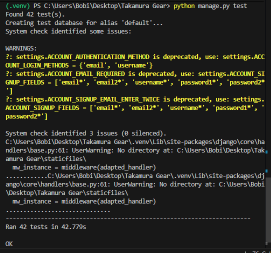

</details>

<details>
<summary>Cart App Tests - 8 tests passed</summary>

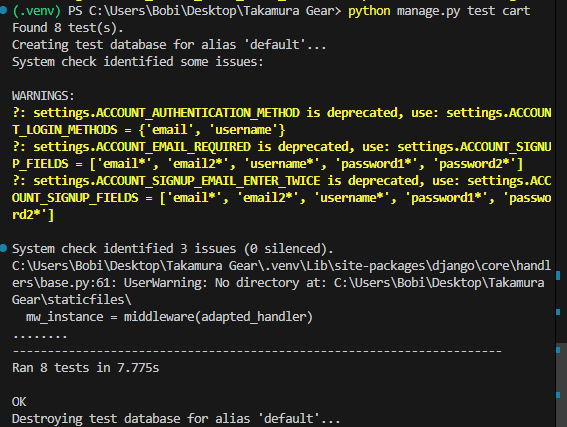

</details>

<details>
<summary>Checkout App Tests - 9 tests passed</summary>

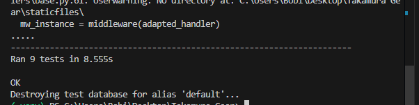

</details>

<details>
<summary>Home App Tests - 4 tests passed</summary>

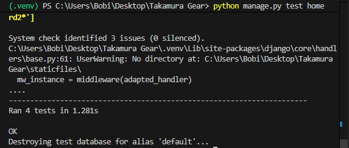

</details>

<details>
<summary>Products App Tests - 13 tests passed</summary>

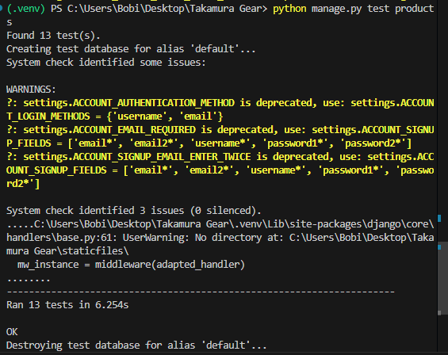

</details>

<details>
<summary>Profiles App Tests - 8 tests passed</summary>

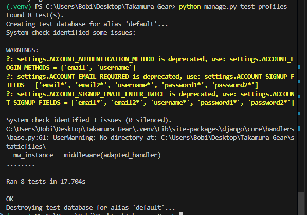

</details>

---
## User Story Testing

### Epic 1: Viewing & Navigation

| User Story | Acceptance Criteria | Status |
|------------|---------------------|--------|
| **US: View Product List** - As a shopper, I want to view all products so that I can browse available MMA gear | Products page shows all items in grid | Pass |
| | Each product shows: image, name, price | Pass |
| | Responsive layout | Pass |
| **US: View Product Details** - As a shopper, I want to view individual product details so that I can decide if I want to buy it | Product detail page with full description | Pass |
| | Shows price, image, available sizes (if applicable) | Pass |
| | Add to cart button | Pass |
| **US: Browse by Category** - As a shopper, I want to filter products by category so that I can find specific gear types quickly | Category navigation in menu | Pass |
| | Category pages show filtered products | Pass |
| | Categories: Gloves, Fight Gear, Protective Equipment, Bags & Equipment | Pass |
| **US: Search Products** - As a shopper, I want to search for products so that I can find specific items | Search bar in navigation | Pass |
| | Search by product name/description | Pass |
| | Shows results count | Pass |

### Epic 2: Registration & User Accounts

| User Story | Acceptance Criteria | Status |
|------------|---------------------|--------|
| **US: Register Account** - As a visitor, I want to register an account so that I can save my details and track orders | Registration form with email/password | Pass |
| | Email verification sent | Pass |
| | Account created in database | Pass |
| **US: Login/Logout** - As a registered user, I want to login and logout so that I can access my account | Login page accessible | Pass |
| | Logout option when logged in | Pass |
| | Session management works | Pass |
| | Success messages displayed | Pass |
| **US: User Profile** - As a registered user, I want to view my profile so that I can see my order history and saved details | Profile page shows default delivery info | Pass |
| | Order history displayed | Pass |
| | Can update delivery information | Pass |

### Epic 3: Shopping Cart

| User Story | Acceptance Criteria | Status |
|------------|---------------------|--------|
| **US: Add to Cart** - As a shopper, I want to add products to cart so that I can purchase multiple items | Add to cart button on product page | Pass |
| | Can select size (if applicable) and quantity | Pass |
| | Cart icon updates with count | Pass |
| | Success message shown | Pass |
| **US: View Cart** - As a shopper, I want to view my cart so that I can see what I'm buying and total cost | Cart page shows all items | Pass |
| | Each item shows: image, name, size, quantity, price | Pass |
| | Subtotal, delivery, and grand total displayed | Pass |
| **US: Update Cart** - As a shopper, I want to adjust quantities or remove items so that I can change my order before checkout | Update quantity in cart | Pass |
| | Remove item button | Pass |
| | Totals update automatically | Pass |

### Epic 4: Purchasing & Checkout

| User Story | Acceptance Criteria | Status |
|------------|---------------------|--------|
| **US: Secure Checkout** - As a shopper, I want to complete payment securely so that I can purchase my items | Checkout form with delivery details | Pass |
| | Stripe payment integration | Pass |
| | Payment processed securely | Pass |
| | HTTPS enabled | Pass |
| **US: Order Confirmation** - As a shopper, I want to see order confirmation so that I know my purchase was successful | Order confirmation page after payment | Pass |
| | Shows order number, items, delivery address, total | Pass |
| | Order saved to profile (if logged in) | Pass |

---

## Manual Feature Testing

### Navigation

| Feature | Test | Expected Result | Actual Result | Pass/Fail |
|---------|------|-----------------|---------------|-----------|
| Logo | Click logo from any page | Redirects to homepage | Redirects to homepage | Pass |
| Main Nav Links | Click each category link | Navigates to correct category | Navigates correctly | Pass |
| Mobile Menu | Toggle hamburger menu on mobile | Menu expands/collapses | Works correctly | Pass |
| Account Dropdown | Click account icon | Shows login/register or profile/logout | Shows correct options | Pass |
| Cart Icon | Click cart icon | Navigates to cart page | Navigates to cart | Pass |
| Cart Count | Add items to cart | Badge updates with item count | Updates correctly | Pass |

### Authentication

| Feature | Test | Expected Result | Actual Result | Pass/Fail |
|---------|------|-----------------|---------------|-----------|
| Registration | Complete signup form | Account created, redirected | Account created successfully | Pass |
| Login | Enter valid credentials | Logged in, redirected to home | Login successful | Pass |
| Logout | Click logout | Logged out, session cleared | Logout successful | Pass |
| Protected Pages | Access profile when logged out | Redirected to login | Redirects correctly | Pass |
| Form Validation | Submit empty registration form | Error messages displayed | Errors shown | Pass |

### Products

| Feature | Test | Expected Result | Actual Result | Pass/Fail |
|---------|------|-----------------|---------------|-----------|
| Product Cards | View products page | All products displayed in grid | Products display correctly | Pass |
| Product Detail | Click product card | Shows full product details | Details displayed | Pass |
| Size Selector (Gloves) | View glove product | Shows oz weight options (8oz-16oz) | Weight options shown | Pass |
| Size Selector (Apparel) | View fight gear product | Shows size options (XS-XXL) | Size options shown | Pass |
| Category Filter | Select category from sidebar | Shows only products in category | Filters correctly | Pass |
| Price Filter | Select price range | Shows products in price range | Filters correctly | Pass |
| Sort by Price (Low-High) | Select sort option | Products ordered by price ascending | Sorts correctly | Pass |
| Sort by Price (High-Low) | Select sort option | Products ordered by price descending | Sorts correctly | Pass |
| Sort by Name | Select sort option | Products ordered alphabetically | Sorts correctly | Pass |
| Combined Filters | Apply category + price + sort | All filters work together | Filters combine correctly | Pass |

### Shopping Cart

| Feature | Test | Expected Result | Actual Result | Pass/Fail |
|---------|------|-----------------|---------------|-----------|
| Add to Cart | Click add to cart | Item added, success message | Item added successfully | Pass |
| Add with Size | Select size and add | Correct size saved in cart | Size saved correctly | Pass |
| Multiple Quantities | Change quantity before adding | Correct quantity added | Quantity correct | Pass |
| View Cart | Navigate to cart | All items displayed with details | Items displayed | Pass |
| Update Quantity | Use +/- buttons | Quantity updates, totals recalculate | Updates correctly | Pass |
| Remove Item | Click remove button | Item removed from cart | Item removed | Pass |
| Different Sizes | Add same product, different sizes | Stored as separate line items | Handled correctly | Pass |
| Empty Cart | Remove all items | Shows empty cart message | Message displayed | Pass |
| Delivery Calculation | Cart under £99 | £5.99 delivery shown | Delivery calculated | Pass |
| Free Delivery | Cart over £99 | £0.00 delivery shown | Free delivery applied | Pass |

### Checkout

| Feature | Test | Expected Result | Actual Result | Pass/Fail |
|---------|------|-----------------|---------------|-----------|
| Empty Cart Redirect | Access checkout with empty cart | Redirected to products | Redirects correctly | Pass |
| Checkout Form | View checkout page | Form fields displayed | Form displays | Pass |
| Form Validation | Submit with empty required fields | Error messages shown | Validation works | Pass |
| Pre-fill (Logged In) | Checkout when logged in with saved info | Form pre-filled with profile data | Pre-fills correctly | Pass |
| Stripe Card Element | View payment section | Card input field loads | Stripe loads | Pass |
| Successful Payment | Use test card 4242 4242 4242 4242 | Payment processes, redirect to success | Payment successful | Pass |
| Order Confirmation | Complete successful payment | Success page with order details | Details displayed | Pass |
| Save Info Checkbox | Check "save info" and complete order | Profile updated with delivery info | Info saved | Pass |

### User Profile

| Feature | Test | Expected Result | Actual Result | Pass/Fail |
|---------|------|-----------------|---------------|-----------|
| View Profile | Navigate to profile (logged in) | Profile page loads | Page loads | Pass |
| Update Information | Change delivery info and save | Info updated, success message | Updates correctly | Pass |
| Order History | View profile with previous orders | Orders listed with details | Orders displayed | Pass |
| Order Detail Link | Click order number | Shows full order details | Details shown | Pass |
| Login Required | Access profile when logged out | Redirected to login | Redirects correctly | Pass |

### Product Management (Superuser)

| Feature | Test | Expected Result | Actual Result | Pass/Fail |
|---------|------|-----------------|---------------|-----------|
| Access Management | Login as superuser, click Product Management | Management page loads with product list | Page loads correctly | Pass |
| Add Product | Click Add New Product, fill form, submit | Product created, redirected to product detail | Product created successfully | Pass |
| Edit Product | Click Edit on a product, modify details, save | Product updated, changes reflected | Updates correctly | Pass |
| Delete Product | Click Delete, confirm in modal | Product removed from database | Product deleted successfully | Pass |
| Category Filters | Click category filter buttons | Shows only products in selected category | Filters correctly | Pass |
| Non-Superuser Access | Login as regular user, try to access /products/management/ | Blocked with error message | Access denied | Pass |

---

## Code Validation

### HTML Validation

All HTML pages were validated using the [W3C Markup Validation Service](https://validator.w3.org/). HTML validation was performed by navigating to each page, right-clicking and selecting "View Page Source", then copying the rendered HTML into the validator.

**Note:** Django template syntax (`` and `{{ }}`) does not appear in the rendered HTML, so validators only see the final HTML output.

| Page | Result | Evidence |
|------|--------|----------|
| Home | Pass | <details><summary>View screenshot</summary></details> |
| Products (All) | Pass | <details><summary>View screenshot</summary>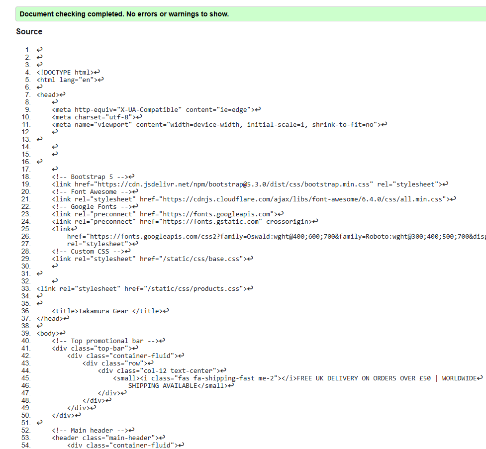</details> |
| Product Detail | Pass | <details><summary>View screenshot</summary>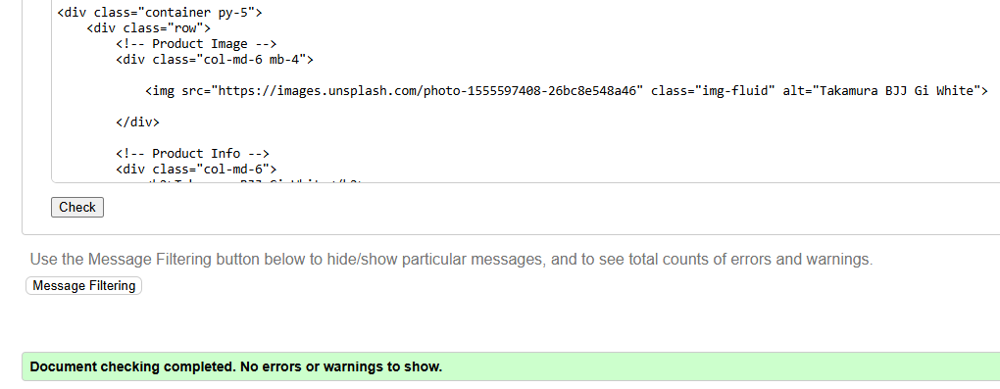</details> |
| Cart (Empty) | Pass | <details><summary>View screenshot</summary>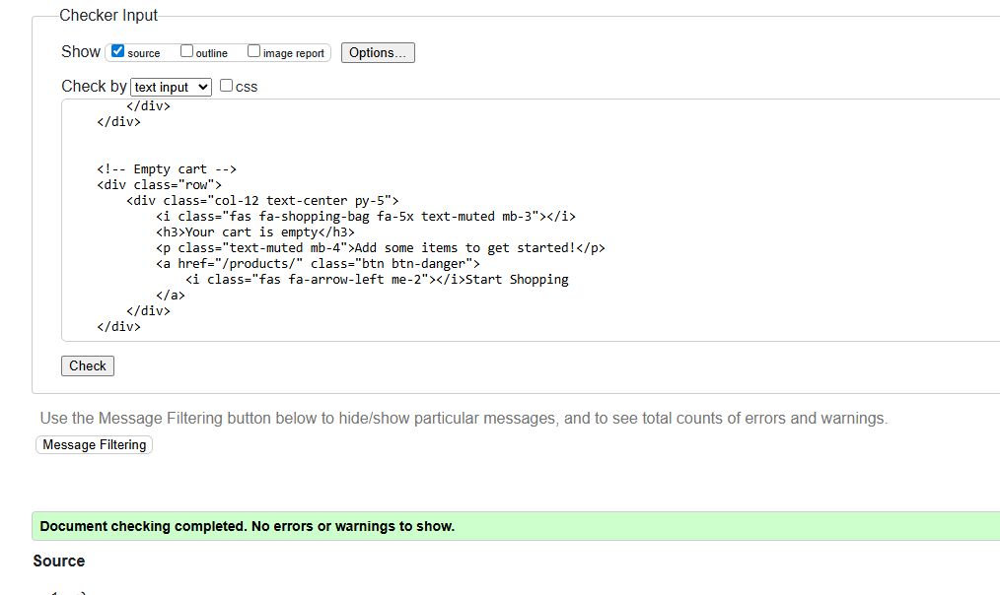</details> |
| Cart (With Items) | Pass | <details><summary>View screenshot</summary>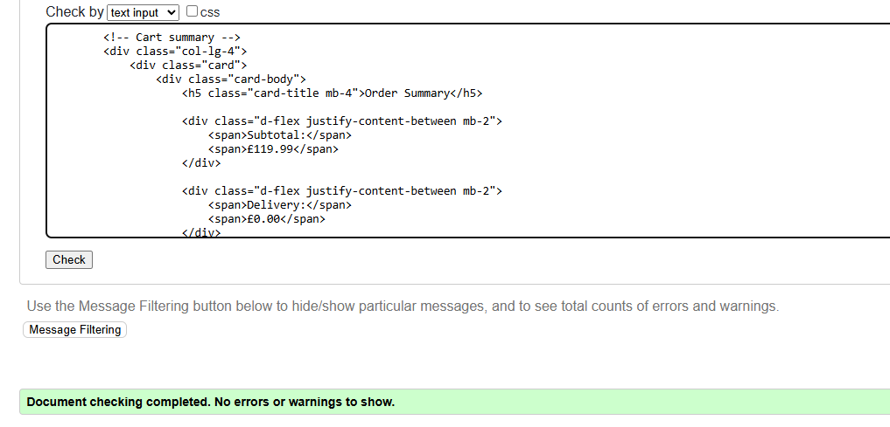</details> |
| Checkout | Pass | <details><summary>View screenshot</summary>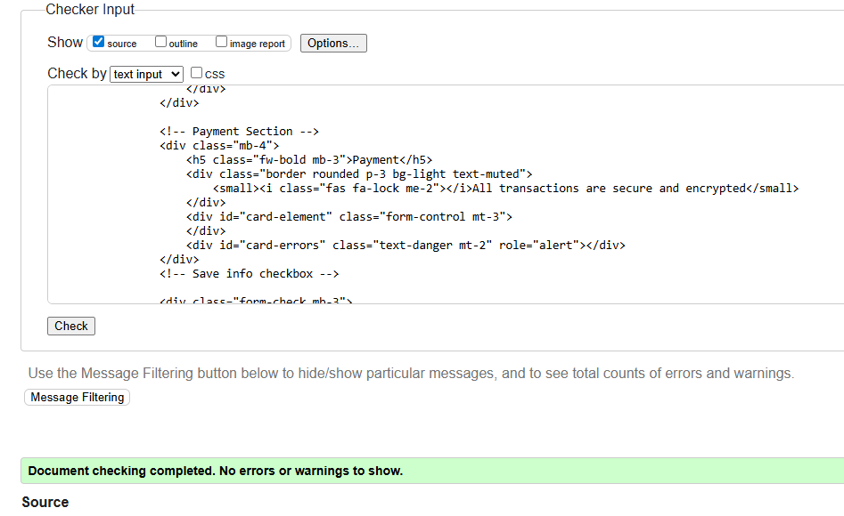</details> |
| Checkout Success | Pass | <details><summary>View screenshot</summary></details> |
| Profile | Pass | <details><summary>View screenshot</summary>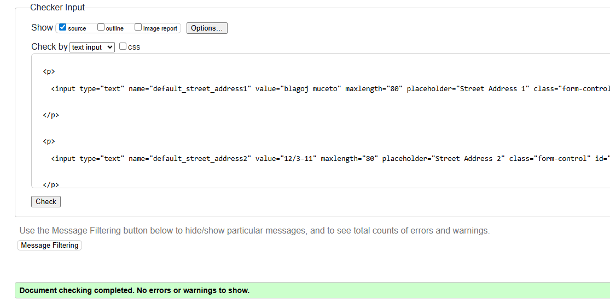</details> |

---

### CSS Validation

All CSS files were validated using the [W3C CSS Validation Service](https://jigsaw.w3.org/css-validator/). All files passed with no errors.

<details><summary>View CSS validation result</summary>


</details>

**Files validated:**
- static/css/base.css
- static/css/home.css
- static/css/products.css
- static/css/product_detail.css
- static/css/cart.css
- static/css/checkout.css
- static/css/profile.css

---

### JavaScript Validation

All JavaScript files were validated using [JSHint](https://jshint.com/) with no errors reported.

**Files validated:**
- static/js/base.js
- static/js/cart.js  
- static/js/product_detail.js
- static/js/stripe_elements.js

<details><summary>View JSHint validation result</summary>


</details>

### Python Validation (CI Python Linter)

| App | Files Checked | Result |
|-----|---------------|--------|
| home | views.py, urls.py | |
| products | models.py, views.py, urls.py, admin.py | |
| cart | views.py, urls.py, contexts.py | |
| checkout | models.py, views.py, urls.py, forms.py, signals.py, admin.py | |
| profiles | models.py, views.py, urls.py, forms.py, admin.py | |
| takamura_gear | settings.py, urls.py | |

---

## Responsiveness Testing

The site was tested across multiple device sizes using Chrome DevTools and physical devices. All pages displayed responsive design across all screen sizes, from mobile (320px) through to large desktop (1920px+). The Bootstrap grid system ensures content reflows appropriately, navigation collapses to a hamburger menu on smaller screens, product grids adjust column counts based on viewport width, and all interactive elements remain accessible and properly sized for touch input on mobile devices.

---


## Bugs & Fixes

### Resolved Bugs

| Bug | Description | Solution |
|-----|-------------|----------|
| Cart Size Grouping | Different sizes of same product were being grouped together | Implemented `items_by_size` dictionary structure in cart session |
| Stripe Element Not Loading | Card input field not appearing | Fixed script loading order - Stripe JS must load before stripe_elements.js |
| Profile Auto-Creation | UserProfile not created for new users | Added Django signal (`post_save` on User model) |
| Country Field Validation | Checkout form rejecting country selection | Changed from CharField to `CountryField` from django-countries |
| VSCode Auto-Formatting | Django template syntax being corrupted | Disabled auto-formatting for HTML files in workspace settings |
| Filter Persistence | Sorting would clear category filter | Added hidden inputs to preserve filter state |
| Order History Not Showing | Orders not linked to user profile | Added `user_profile` ForeignKey to Order model |

### Known Issues

| Issue | Description | Status |
|-------|-------------|--------|
| Stripe Webhooks | Webhook handling not implemented | Future enhancement |

---

## Stripe Testing

Stripe payments were tested using Stripe's test mode with the following test card:

| Card Number | Expiry | CVC | Result |
|-------------|--------|-----|--------|
| 4242 4242 4242 4242 | Any future date | Any 3 digits | Payment successful |

Testing confirmed:
- Stripe card element loads correctly on checkout page
- Valid test card payment processes successfully
- Order is created in database after successful payment
- Cart is cleared after successful checkout
- User is redirected to order confirmation page

## Email Testing

Email confirmations were tested in both development and production environments:

**Development (DEBUG=True):**
- Emails print to console for testing
- Email content displays correctly with order details
- No actual emails sent (console backend)

**Production (Heroku - DEBUG=False):**
- Emails sent via Gmail SMTP
- Order confirmation emails delivered successfully
- Contains order number, items, prices, and delivery address
- Professional formatting maintained

---

*Testing documentation for Takamura Gear - Code Institute Milestone Project 4*
